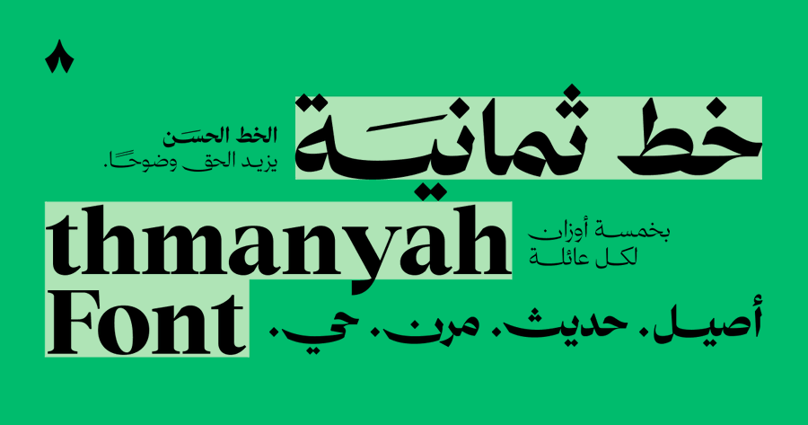

<div dir="rtl" align="right">

# خط ثمانية للويب — Thmanyah Font Web



**حزمة مجتمعية لعائلة خطوط ثمانية للويب — ثلاث عائلات، خمسة أوزان لكل عائلة.** أضف ملف CSS واحد لمشروعك وابدأ باستخدام ثمانية سانس، ثمانية سيريف ديسبلاي، وثمانية سيريف تكست فورًا.

> **ملاحظة:** خط ثمانية من تصميم وملكية [ثمانية](https://thmanyah.com). هذا المستودع حزمة مجتمعية تعيد تجميع الخطوط لتسهيل استخدامها على الويب عبر npm و CDN.

**[🇬🇧 Read in English](./README.en.md)**

---

## 📦 معلومات الحزمة

[](https://www.npmjs.com/package/@engdawood/thmanyah-font-web)

[](#عائلات-الخطوط-والأوزان)

---

## 🌍 تجربة 

🔗 [عرض خط ثمانية](https://engdawood.github.io/thmanyah-font-web/examples/demo.html)

---

## 🔗 روابط ثمانية الرسمية

| | الرابط |
|---|---|
| 🎨 **جرّب الخط** | [font.thmanyah.com](https://font.thmanyah.com/) |
| 𝕏 **إعلان الخط** | [ثمانية على X](https://x.com/thmanyah/status/2046944611969487256?s=20) |
| 📜 **ترخيص الخط** | [font.thmanyah.com/licenses](https://font.thmanyah.com/licenses) |

---

## 🚀 البداية السريعة

### الطريقة ١ — CDN (الأسرع)

أضف وسم `<link>` واحد لصفحتك. بدون تثبيت، بدون تحميل، بدون أي إعدادات.

**jsDelivr:**

```html
<link
  rel="stylesheet"
  href="https://cdn.jsdelivr.net/npm/@engdawood/thmanyah-font-web/index.css"
/>
```

**unpkg:**

```html
<link
  rel="stylesheet"
  href="https://unpkg.com/@engdawood/thmanyah-font-web/index.css"
/>
```

### الطريقة ٢ — مدير الحزم

```bash
npm install @engdawood/thmanyah-font-web
```

ثم استورد ملف CSS في مشروعك:

```css
/* في ملف CSS */
@import "@engdawood/thmanyah-font-web";
```

```js
// أو في نقطة الدخول JS/TS
import "@engdawood/thmanyah-font-web";
```

### الطريقة ٣ — التحميل اليدوي

1. حمّل هذا المستودع
2. انسخ مجلد `fonts/` وملف `index.css` لمشروعك
3. اربط `index.css` في صفحتك:

```html
<link rel="stylesheet" href="path/to/index.css" />
```

---

## 🔤 عائلات الخطوط والأوزان

| العائلة | قيمة `font-family` في CSS | الأوزان |
| --- | --- | --- |
| **ثمانية سانس** | `"Thmanyah Sans", sans-serif` | خفيف 300 · عادي 400 · متوسط 500 · سميك 700 · أسود 900 |
| **ثمانية سيريف ديسبلاي** | `"Thmanyah Serif Display", serif` | خفيف 300 · عادي 400 · متوسط 500 · سميك 700 · أسود 900 |
| **ثمانية سيريف تكست** | `"Thmanyah Serif Text", serif` | خفيف 300 · عادي 400 · متوسط 500 · سميك 700 · أسود 900 |

---

## 💡 أمثلة الاستخدام

### خصائص CSS مباشرة

```css
body {
  font-family: "Thmanyah Sans", sans-serif;
  font-weight: 400;
  direction: rtl;
}

h1,
h2,
h3 {
  font-family: "Thmanyah Serif Display", serif;
  font-weight: 700;
}

article p {
  font-family: "Thmanyah Serif Text", serif;
  font-weight: 400;
}
```

### الأصناف الجاهزة (Utility Classes)

الحزمة تأتي مع أصناف CSS جاهزة للاستخدام:

```html
<!-- أصناف العائلة -->
<p class="font-thmanyah-sans">ثمانية سانس</p>
<h1 class="font-thmanyah-serif-display">ثمانية سيريف ديسبلاي</h1>
<p class="font-thmanyah-serif-text">ثمانية سيريف تكست</p>

<!-- أصناف الوزن -->
<p class="font-thmanyah-sans font-weight-light">وزن خفيف — 300</p>
<p class="font-thmanyah-sans font-weight-regular">وزن عادي — 400</p>
<p class="font-thmanyah-sans font-weight-medium">وزن متوسط — 500</p>
<p class="font-thmanyah-sans font-weight-bold">وزن سميك — 700</p>
<p class="font-thmanyah-sans font-weight-black">وزن أسود — 900</p>
```

### مرجع الأصناف الجاهزة

| الصنف | التأثير |
| --- | --- |
| `.font-thmanyah-sans` | `font-family: "Thmanyah Sans", sans-serif` |
| `.font-thmanyah-serif-display` | `font-family: "Thmanyah Serif Display", serif` |
| `.font-thmanyah-serif-text` | `font-family: "Thmanyah Serif Text", serif` |
| `.font-weight-light` | `font-weight: 300` |
| `.font-weight-regular` | `font-weight: 400` |
| `.font-weight-medium` | `font-weight: 500` |
| `.font-weight-bold` | `font-weight: 700` |
| `.font-weight-black` | `font-weight: 900` |

---

## 📁 هيكل المستودع

```
thmanyah-font-web/
├── fonts/
│   ├── thmanyah-sans/woff2/
│   ├── thmanyah-serif-display/woff2/
│   └── thmanyah-serif-text/woff2/
├── public/
│   └── image.png
├── examples/
│   └── demo.html
├── index.css
├── README.md          (هذا الملف - عربي)
├── README.en.md       (English)
└── package.json
```

---

## ⚙️ تفاصيل تقنية

- **الصيغة الأساسية:** WOFF2 (مضغوطة، أفضل دعم للمتصفحات)
- **`font-display: swap`** — النص يظهر فورًا، والخط يُحمّل في الخلفية
- **`unicode-range`** — يغطي العربية (U+0600-06FF) واللاتينية الأساسية (U+0020-02AF)
- **جاهز لـ RTL** — مصمم ومُحسّن للكتابة من اليمين لليسار

---

## 📄 الترخيص

خط ثمانية من تصميم وملكية [ثمانية](https://thmanyah.com). تفاصيل الترخيص على [font.thmanyah.com/licenses](https://font.thmanyah.com/licenses).

حزمة الويب المجتمعية (إعداد CSS و CDN) بواسطة [@engdawood](https://github.com/engdawood).

---

## 🤝 المساهمة

المساهمات مرحّب بها! لا تتردد في فتح Issues أو تقديم Pull Requests.

1. افعل Fork للمستودع
2. أنشئ فرعك (`git checkout -b feature/improvement`)
3. نفّذ تعديلاتك (`git commit -m 'Add improvement'`)
4. ادفع للفرع (`git push origin feature/improvement`)
5. افتح Pull Request

</div>
